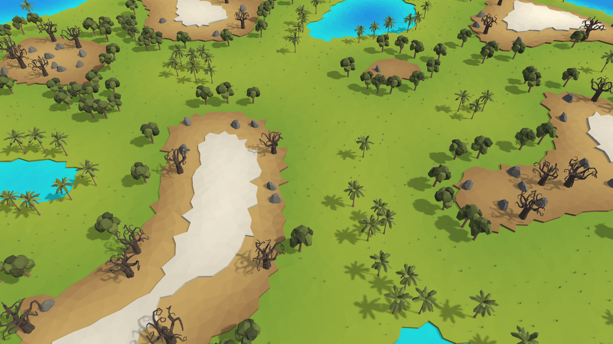

# Procedural Low-Poly Terrain Generation

In computer games, traditional procedural terrain generation relies on a grid of vertices, with each point representing terrain elevation. For each square in the grid, two triangles are created by connecting fixed vertex indices, resulting in a continuous 3D surface. While this method is efficient for modelling smooth terrain, the gridlike structure lacks the distinct, chaotic appearance of low-poly objects and is not suitable to be used for our purposes.

The technique presented in this repository aims to solve the following problem: Generate random, low-poly looking terraced terrain with different biomes and add vegetation to create an interesting environment.

